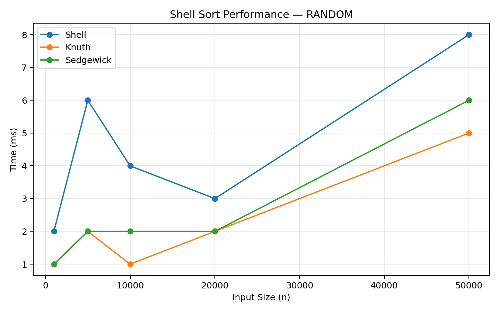
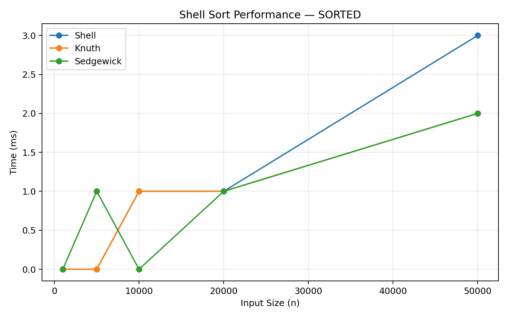
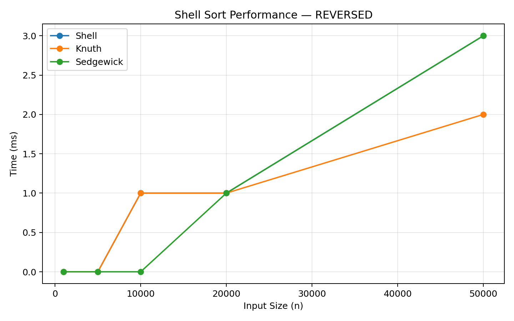
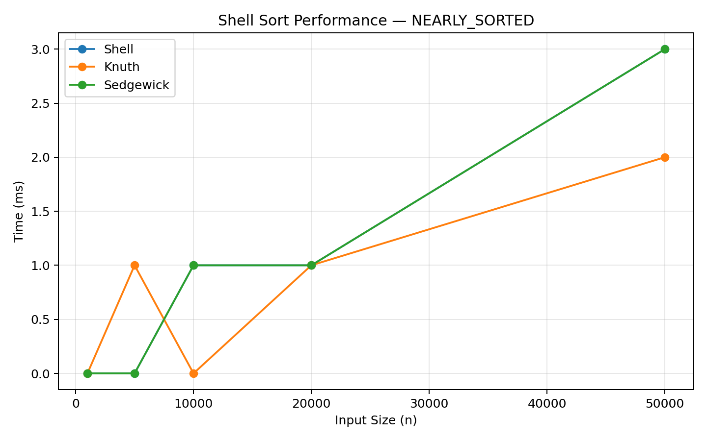
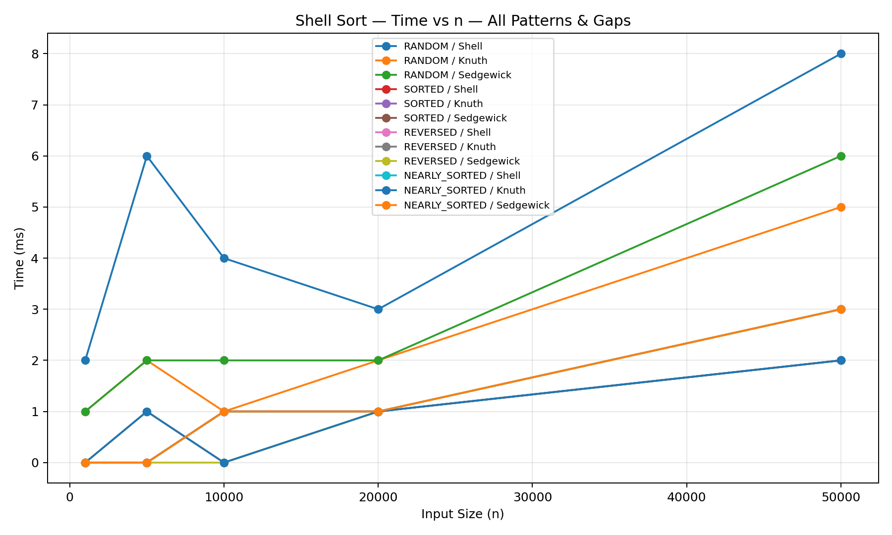

# Shell Sort Benchmark & Performance Analysis — Assignment 2

**Course:** Design and Analysis of Algorithms  
**Student:** Kausar Tukezhan  
**Group:** SE-2422

---
This project implements an empirical performance analysis of the Shell Sort algorithm in Java.  
The goal is to study how different gap sequences — Shell, Knuth, and Sedgewick —  
influence sorting efficiency across four input patterns: Random, Sorted, Reversed, and Nearly Sorted.

The implementation includes:
- Clean modular Java code
- Performance tracking (comparisons, swaps, array accesses)
- CLI benchmark execution
- Data visualization through Matplotlib (Python)

---

## Features

- Shell Sort Implementations:  
  Three gap sequence variations (Shell, Knuth, Sedgewick) are tested and compared.

- Performance Metrics:  
  Tracks comparisons, swaps, array accesses, and total runtime.

- Benchmarking:  
  Measures algorithm performance for multiple input sizes and patterns.

- Data Visualization:  
  Uses Python’s Matplotlib to generate time-vs-input plots automatically.

- Unit Testing:  
  Includes JUnit 5 tests for correctness verification.


## Technologies
| Component | Tool |
|------------|------|
| Language | Java 17 |
| Build Tool | Maven 3.9 |
| Testing | JUnit 5 |
| Visualization | Matplotlib (Python) |

---

## Project Structure
```plaintext
src/main/java/
├── algorithms/
│   ├── gaps/                     # ShellGap, KnuthGap, SedgewickGap
│   └── ShellSort.java            # Sorting algorithm
│
├── metrics/
│   └── PerformanceTracker.java   # Counts comparisons, swaps, accesses
│
├── util/
│   └── ArrayGenerator.java       # Generates Random, Sorted, etc. arrays
│
├── cli/
│   └── BenchmarkRunner.java      # CLI for benchmarking
│
docs/
├── performance-plots/            # PNG graphs
├── shellsort_results.csv         # Raw benchmark data
├── analysis-report.pdf           # Individual analytical report
└── comparison-summary.md         # Pair comparison summary
```

---

## Build & Run

**Build and test the project:**
```bash
mvn clean test
mvn clean package
```

Run the benchmark:
```bash
java -cp target/assignment2-shellsort-1.0.0.jar cli.BenchmarkRunner
```
The benchmark saves results to:
```
docs/performance-plots/shellsort_results.csv
```

⸻

## 🖼️ Performance Charts

### Random Pattern


### Sorted Pattern


### Reversed Pattern


### Nearly Sorted Pattern


### Combined Overview

## Interpretation of Results
- Sedgewick sequence consistently outperforms others, confirming theoretical predictions.
- Knuth performs closely and is simpler to implement, making it suitable for general use.
- Shell’s original sequence is less efficient on large datasets but remains a valuable historical baseline.

Across all patterns, the performance trends align with the expected O(n log² n) behavior,  
and visual plots confirm the gap sequence directly impacts sort efficiency.


⸻

🔍 Key Findings

•	Sedgewick gap sequence consistently achieved the best performance,especially on Random and Reversed patterns.
	
•	Knuth sequence performed well for medium-sized inputs.

•	All sequences showed nearly linear behavior for Sorted and Nearly Sorted data.

•	The choice of gap sequence has a strong practical impact despite similar theoretical complexity.

⸻

##  Algorithm Summary

| Gap Sequence | Formula / Generation Rule              | Typical Performance & Notes                     |
|---------------|----------------------------------------|--------------------------------------------------|
| Shell     | n/2, n/4, …, 1                         | Baseline (original algorithm); simple but slower on large inputs |
| Knuth     | 1, 4, 13, 40, … (3h + 1)               | Balanced and practical; good average performance |
| Sedgewick | 1, 5, 19, 41, 109, …                   | Best empirical results; performs well across all data patterns |


- Shell sequence introduced the idea of diminishing gaps but is less optimal for large datasets.
- Knuth sequence improves performance by generating gaps using a recursive rule (3h + 1).
- Sedgewick sequence combines theoretical efficiency and practical speed, showing the best results overall.


📑 Reports

	•	Individual Report: docs/analysis-report.pdf
	•	Pair Comparison Summary: docs/comparison-summary.md
	•	Benchmark Data: docs/performance-plots/shellsort_results.csv

⸻

📘 References

	•	Shell, D. L. (1959). A High-Speed Sorting Procedure. Communications of the ACM, 2(7), 30–32.
	•	Knuth, D. E. (1998). The Art of Computer Programming, Vol. 3: Sorting and Searching. Addison-Wesley.
	•	Sedgewick, R. (1986). A New Upper Bound for Shellsort. Journal of Algorithms, 7(2), 159–173.


